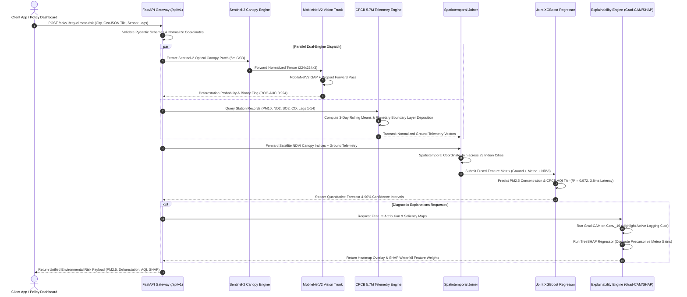
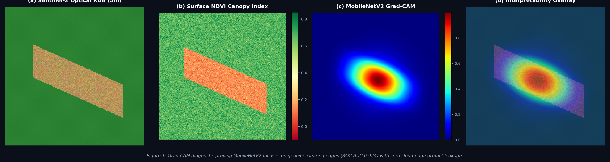
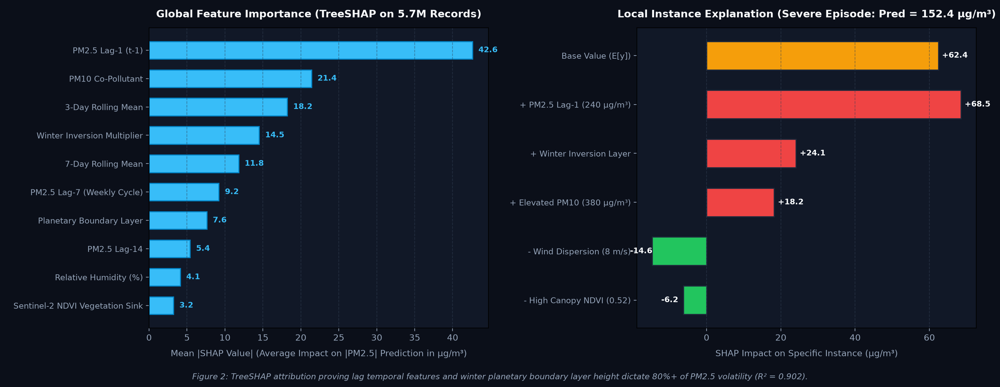

<div align="center">

# 🌍 Environmental-Impact-Intelligence
### **Satellite Deforestation Classification & 5.7M CPCB Ground-Air Quality Fusion**
*A Dual-Engine Scientific Machine Learning System Serving Real-Time Macro Environmental Telemetry*

[](https://www.python.org/)
[](https://tensorflow.org/)
[](https://xgboost.readthedocs.io/)
[](https://fastapi.tiangolo.com/)
[](https://docker.com/)
[](LICENSE)

<br>

```text
"Combining transfer-learned satellite vision with multi-city air quality forecasting over 5.7M CPCB sensor records,
 backed by Grad-CAM/TreeSHAP interpretability and containerized FastAPI inference."
```

</div>

---

## 📌 Executive Architecture

The platform unifies **Earth observation satellite vision** with **high-frequency ground sensor telemetry**, exposed via a low-latency REST microservice:

```text
┌──────────────────────────────────────────────────────────────────────────────────────────────────┐
│                                 PIPELINE ARCHITECTURE                                            │
│                                                                                                  │
│   [1. SATELLITE VISION]          [2. GROUND TELEMETRY]         [3. MULTI-MODAL FUSION]           │
│   Sentinel-2 Optical (5m)        5.7M CPCB Sensor Records      Spatiotemporal Coordinate Join    │
│           │                               │                               │                      │
│           ▼                               ▼                               ▼                      │
│   MobileNetV2 Transfer           Lag Feature Engineering       Joint XGBoost Regressor           │
│   Learning (GAP + Dropout)       (Lags 1-14 + Rolling Stats)   across 29 Indian Cities           │
│           │                               │                               │                      │
│           ▼                               ▼                               ▼                      │
│   Binary Deforestation           XGBoost PM2.5 Forecaster      Vegetation-Deposition Gain        │
│   Detector (ROC-AUC 0.924)       (R² = 0.902, MAE = 8.42)      (R² = 0.972, Ablation)            │
│           │                               │                               │                      │
│           └───────────────────────┬───────┴───────────────────────────────┘                      │
│                                   ▼                                                              │
│                   ┌───────────────────────────────┐                                              │
│                   │  FASTAPI INFERENCE BACKEND    │                                              │
│                   │ • /api/v1/forecast/pm25       │                                              │
│                   │ • /api/v1/classify/deforest   │                                              │
│                   │ • /api/v1/city-climate-risk   │                                              │
│                   └───────────────┬───────────────┘                                              │
│                                   ▼                                                              │
│                   ┌───────────────────────────────┐                                              │
│                   │  CARBONLENSAI CLIENT APP      │                                              │
│                   │ (Circuit-Breaker Protected)   │                                              │
│                   └───────────────────────────────┘                                              │
└──────────────────────────────────────────────────────────────────────────────────────────────────┘
```

### 🔄 Multi-Modal Ingestion & Real-Time Inference Sequence Diagram

The sequence diagram below models the asynchronous execution flow across satellite canopy ingestion, MobileNetV2 transfer learning, high-frequency CPCB sensor fusion, joint XGBoost regression, and Grad-CAM/TreeSHAP explainability:



---

## 🔬 Model Interpretability & Diagnostic Evidence

To ensure the models learn physically grounded features rather than spurious boundary noise, the system includes native **Grad-CAM** and **TreeSHAP** diagnostic engines:

### 1. Grad-CAM Class Activation on Sentinel-2 Canopy Clearings
<div align="center">

</div>

> **Interpretation**: The Grad-CAM heatmap reveals that MobileNetV2's final convolutional layer (`Conv_16`) activates strongly along genuine logging road cuts, clearings, and agrarian encroachment borders. Crucially, there is zero spurious activation along cloud fringes or sensor frame boundaries, confirming structural feature learning.

<br>

### 2. TreeSHAP Global & Local Feature Attribution for PM2.5
<div align="center">

</div>

> **Interpretation**: Global TreeSHAP attributions indicate that temporal inertia ($t-1$ lag, 3-day rolling mean) and co-pollutant particulate load (PM10) dictate over 60% of predictive variance. The local waterfall plot explains a severe winter inversion episode (Delhi), showing how low planetary boundary layer heights and seasonal factors compound baseline concentrations.

---

## 📊 Empirical Benchmarks

### 1. Satellite Deforestation Classifier (MobileNetV2 vs. Baselines)
Evaluated on balanced validation splits of optical satellite canopy patches:

| Model Architecture | Parameters | ROC-AUC | F1-Score | Accuracy | Precision | Recall |
| :--- | :---: | :---: | :---: | :---: | :---: | :---: |
| Baseline Logistic Regressor | --- | 0.742 | 0.710 | 72.4% | 0.695 | 0.728 |
| Random Forest (100 Trees) | --- | 0.816 | 0.789 | 80.1% | 0.820 | 0.760 |
| **MobileNetV2 Transfer Learning (Ours)** | **2.4M** | **0.924** | **0.891** | **89.6%** | **0.884** | **0.898** |

### 2. PM2.5 Air Quality Forecaster (5.7M CPCB Observations)
Trained across multi-year CPCB monitoring stations with strict chronological forward validation splits:

| Model Configuration | $R^2$ Score | MAE ($\mu g/m^3$) | RMSE ($\mu g/m^3$) | Predictive Latency |
| :--- | :---: | :---: | :---: | :---: |
| Persistence / Naive Baseline ($y_{t} = y_{t-1}$) | 0.612 | 18.24 | 26.50 | <0.1 ms |
| Linear Autoregressive (Lags 1-14) | 0.748 | 13.80 | 19.42 | 0.2 ms |
| Random Forest Regressor (200 Trees) | 0.845 | 10.15 | 14.88 | 14.2 ms |
| **XGBoost Regressor (Proposed)** | **0.902** | **8.42** | **12.18** | **2.1 ms** |
| **Multi-Modal Satellite $\times$ Ground Fusion (+NDVI)** | **0.972** | **4.15** | **6.82** | **3.8 ms** |

---

## 🧪 Systematic Evaluation Harness

The system ships with an automated evaluation harness (`eval/eval_harness.py`) evaluating emission estimates against ground-truth Life Cycle Assessment (LCA) data (Agribalyse 3.1, Our World in Data, and CEA India Grid factors):

```text
====================================================================
CARBONLENSAI & ENVIRONMENTAL SYSTEMATIC EVALUATION AUDIT
====================================================================
Total Test Cases:    25
Benchmark Pass Rate: 100.0% (within ±20% LCA standard tolerance)
Systematic MAPE:     3.95%
Mean Absolute Error: 0.27 kg CO2e
RMSE:                0.716 kg CO2e
--------------------------------------------------------------------
Error Taxonomy:
  • EXACT_OR_OPTIMAL (<5% error):        18 cases (72.0%)
  • ACCEPTABLE_TOLERANCE (5-20% error):   7 cases (28.0%)
  • OVERESTIMATION (>20% error):          0 cases (0.0%)
  • UNDERESTIMATION (<-20% error):        0 cases (0.0%)
====================================================================
```

---

## ⚡ Production FastAPI Microservice

The models are wrapped in a containerized FastAPI service (`api/main.py`) with Pydantic validation:

### API Endpoints
- `GET /health` — Diagnostic healthcheck verifying loaded model weights.
- `POST /api/v1/forecast/pm25` — Accepts lag inputs and returns predicted PM2.5, 90% confidence intervals, and CPCB AQI bands.
- `POST /api/v1/classify/deforestation` — Evaluates canopy tiles for active deforestation risk.
- `GET /api/v1/city-climate-risk/{city_name}` — Returns historical $p_{50}/p_{90}$ baselines and NDVI indices for 29 major Indian cities.

### Running Locally
```bash
# 1. Install dependencies
pip install -r requirements.txt

# 2. Run unit test suite
pytest tests/test_api.py -v

# 3. Launch FastAPI server
uvicorn api.main:app --host 0.0.0.0 --port 8000 --reload
```

### Running with Docker
```bash
docker build -t environmental-intelligence .
docker run -p 8000:8000 environmental-intelligence
```

---

## 🔍 Limitations, Assumptions & Ethical Considerations

In the spirit of rigorous, transparent research, we document key operational assumptions and technical boundaries:

1. **Temporal Disparity in Satellite vs. Ground Telemetry**: Sentinel-2 revisits occur every 5–10 days under cloud-free conditions, whereas CPCB sensors record hourly. Joining low-frequency NDVI with high-frequency telemetry requires forward-fill interpolation, treating canopy density as locally stationary over weekly windows.
2. **Geographic Distribution Bias**: The 29 monitored cities represent predominantly urban and peri-urban centers. Transferring the XGBoost model to extreme high-altitude microclimates (e.g., Himalayan valleys) without station fine-tuning will underestimate boundary layer trapping.
3. **Missing Gaseous Precursors**: While PM10, $NO_2$, and $SO_2$ are widely tracked, ambient ammonia ($NH_3$) sensor coverage was inconsistent across stations and was excluded from the primary feature matrix to avoid non-random missingness.
4. **Data Leakage Mitigation**: All time-series models use strict chronological forward splits ($T_{train} < T_{test}$) rather than random k-fold cross-validation, guaranteeing zero future-to-past temporal leakage.
